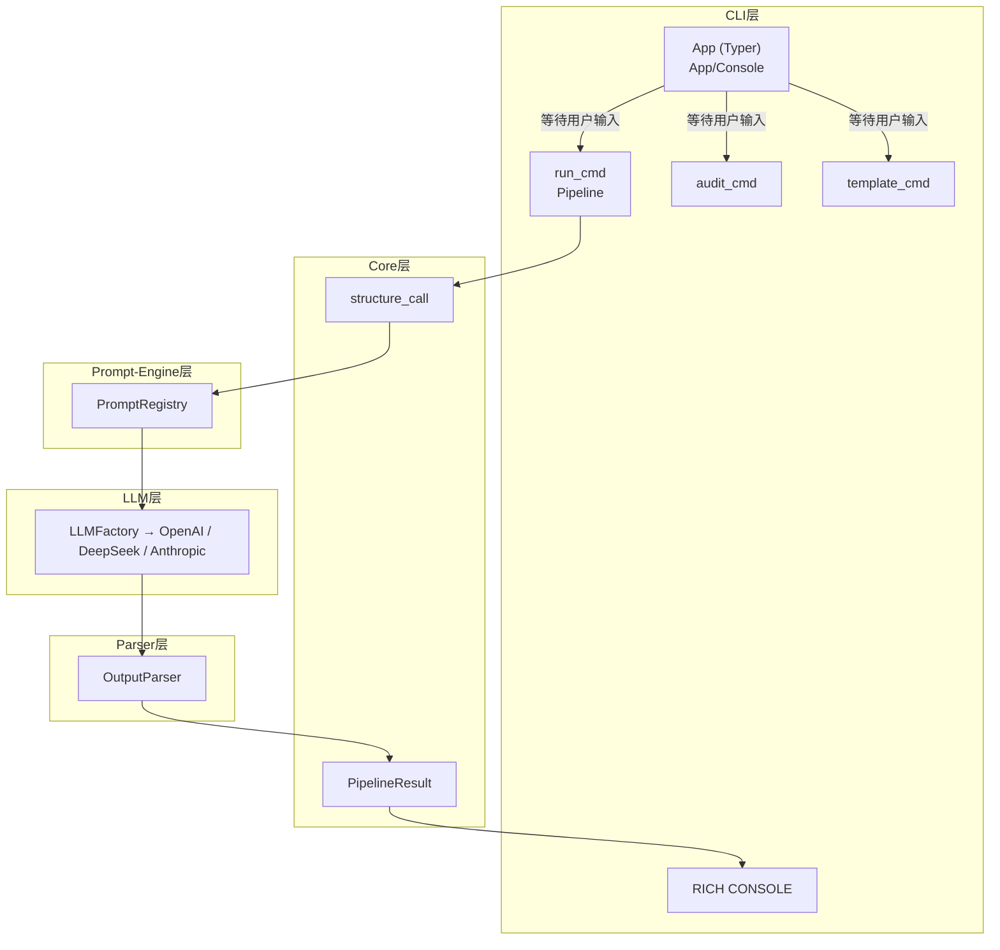

# LLM Client
一个现代化的、生产级 Python LLM 客户端框架

## 架构


## 核心功能
- 多Provider LLM抽象实现（Openai, Anthropic, Deepseek,工厂模式统一管理，易于扩展）
- 生产级弹性机制（指数退避重试+速率限流+并发量控制）
- prompt版本控制（SHA256哈希+审计日志）
- 结构化输出解析（Pydantic+Json强制补全）
- Token追踪（本地轻量化追踪+分别追踪 prompt / completion tokens）
- 工厂模式 + 单例模式 （连接池复用，避免重复连接开销）
- CLI工具链（Typer + Rich终端渲染）
- 生产级Jinja2模板支持

## 安装

### 安装要求
python = ">=3.10"

### 安装依赖
```bash
git clone https://github.com/Linppz/mini-project.git
cd llm-client
uv sync
```

### 环境变量
``` env
OPENAI_API_KEY=你的key
ANTHROPIC_API_KEY=你的key
DEEPSEEK_API_KEY=你的key
```

## 使用方式

### 代码审查
```bash
uv run python -m src.cli.app run code-review --file-name test.py
```

### 模板管理
```bash
uv run python -m src.cli.app template list
uv run python -m src.cli.app template render
```
### 日志管理
```bash
uv run python -m src.cli.app audit show
uv run python -m src.cli.app audit diff
```

## 项目结构
```
src/
├── cli/ # CLI 命令层
├── core/ # 核心基础设施
├── llm/ # LLM 客户端
├── prompt_engine/ # 模板引擎
├── parser/ # 输出解析
└── schemas/ # 数据模型
```

## 技术栈

- **openai / anthropic** — LLM SDK
- **httpx** — HTTP 客户端
- **tiktoken** — Token 计算
- **typer / rich** — CLI 框架
- **tenacity** — 重试机制
- **jinja2** — 模板渲染
- **aiolimiter** — 速率限流
- **pydantic** — 数据校验
- **tomli** — 配置文件解析
- **mypy / pytest / ruff** — 代码质量检查